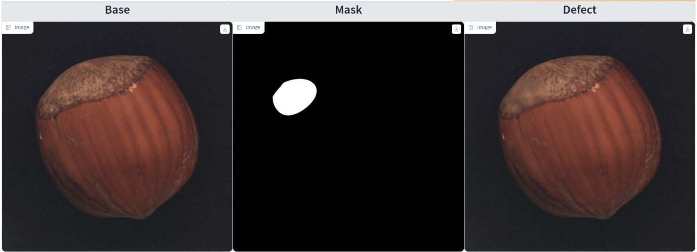

<p align="center">
  <h1><center> &#127981; Industrial Defect Generator &#127981; </center></h1>
</p>

# Description
This library aims to give a simple access to the proposed defect generation approaches for industrial defects. 

## Access to demo 
A demo is available in HuggingFace : LINK

## Base usage 
The library is designed to be straightforward to use with a single function that generate one or several defects and masks
```python 
image = Image.open('path/to/your/image').convert('RGB')
defGen=DefectGenerator(image.size)
defect,msk=defGen.genDefect(image,defectType=["nsa"])
```


### Arguments

- `image` `(Pil Image)` : The input image 
- `defectType` `(List[str])` : A list of string containing the defect types, candidates are "nsa", "structural", "textural", "blurred"
- `category` `(str, default="")` : The object category to mask the background if necessary 
- `return_list` `(bool, default=False)` : To generate the output as a list of defective image and masks instead of a single defective image and mask

### Output
If return_list is False :
- `imageDefect` `(torch.Tensor)` : The generated defective image 
- `mask` `(torch.Tensor)` : The mask of the generated defect

If return_list is True : 
- `imageDefect` `(List[torch.Tensor])` : The list of the generated defective images 
- `mask` `(List[torch.Tensor])` : The list of the masks of the generated defects


### Notes 
- If defectType contains multiple elements and return_list is false, the function generate a random defect among the possibilites in defectType. If return_list is True, the function return a list of images and a list of masks with each defects from defectType.
- To modify in details the defect generation, you may want to modify the files in source/

# Implemented methods 
Methods currently implemented in the library 

## NSA
Article : https://arxiv.org/pdf/2109.15222.pdf  
Code inspiration : https://github.com/hmsch/natural-synthetic-anomalies  
<p align="left">
  
</p>

## DRAEM
Article : https://arxiv.org/pdf/2108.07610.pdf  
Code inspiration : https://github.com/VitjanZ/DRAEM
<p align="left">
  
</p>

## MemSeg
Article : https://arxiv.org/ftp/arxiv/papers/2205/2205.00908.pdf  
Code inspiration : https://github.com/TooTouch/MemSeg
<p align="left">
  
</p>

## CSE
Article : https://arxiv.org/pdf/2403.01859.pdf  
Code inspiration : TODO
<p align="left">
  
</p>